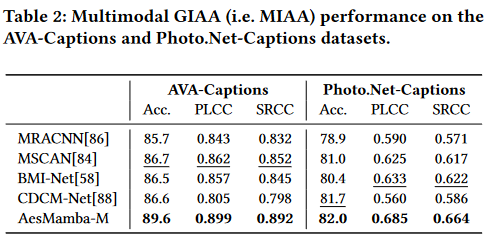

# AesMamba: Universal Image Aesthetic Assessment with State Space Models
[ACM MM'24] Oral, AesMamba


## TODO
- [x] Add training code and config files
- [x] Add checkpoint and script for 


## Model Arch


## VIAA
 

## FIAA
 

## MIAA
 

## PIAA
 

## env
requirements:
- Linux
- NVIDIA GPU
- PyTorch 1.12+
- CUDA 11.6+
# our version(advised)
```pip install torch==1.13.1+cu117 torchvision==0.14.1+cu117 torchaudio==0.13.1 --extra-index-url https://download.pytorch.org/whl/cu117```
```pip install --upgrade pip setuptools wheel```


# install mamba
```conda create -n Aesmamba python=3.8```
```conda activate Aesmamba```

```git clone https://github.com/state-spaces/mamba.git```
```cd mamba```
```MAMBA_FORCE_BUILD=TRUE pip install .```

# other requirements
```cd ../Aesmamba```
```pip install -r requirements.txt```
# VIAA task
```cd AesMamba_v && python train_viaa.py```
# MIAA task
```cd AesMamba_m && python train_miaa.py```
# FIAA task
```cd AesMamba_f && python train_multi_attr_add_balce.py```
# PIAA task
```cd AesMamba_p && python multi_attr_pred_model_add_human_attr.py.py```


you can change the config in their corrsponding .py file 

in our code,we classified the image by it's score in each dataset,their csv file is here:

# pretrain path
vmamba tiny and bert base
we use old version of vmamba,the ckpt is here:
link: https://pan.baidu.com/s/1REVTVD4w20G7lKnIM-Btjg   passward: c1mk


vmamba base and it's conda environment for ImageNet1k
please ref https://github.com/MzeroMiko/VMamba
